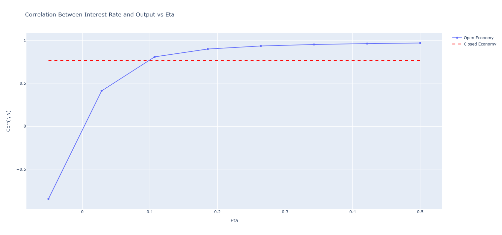
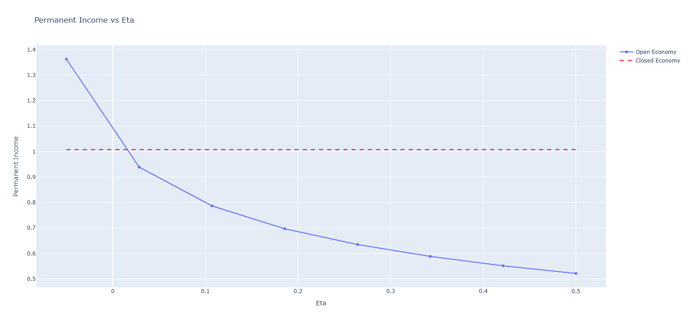

<link rel="stylesheet" href="style.css">

  <a href="#about">About</a>
  <a href="#projects">Projects</a>
  <a href="#shortpapers">Short Papers</a>
  <a href="#contact">Contact</a>

<h2 id="about">About Me</h2>

I hold a Ph.D. in Economics from the University of Zurich, where I conducted research in international finance, empirical banking, and the macroeconomic effects of automation. I am currently working as a Quantitative Analyst at BIT Capital.

This page features selected blog articles, models, and code that reflect my work and interests in applied econometrics, finance and global macroeconomics.

  

<h2 id="projects">Projects</h2>

  <h3>Consumption Slowdown after the Great Recession</h3>
  

    Consumption growth in the United States slowed markedly following the 2007–2009 financial crisis. We argue that costly regulatory interventions targeting banks with foreclosure-related misconduct contributed to this decline by constraining credit supply. Using variation in county-level exposure to affected banks, we show that tighter regulatory controls reduced mortgage loan origination, leading to weaker house price recoveries and lower household wealth. We find that consumption growth slowed more in counties more exposed to these banks, consistent with a wealth effect transmitted through housing markets. The decline in mortgage lending reflects a reduction in the number of loans rather than in average loan size, suggesting that regulation operated primarily through extensive-margin credit supply.
  

  
<a href="projects/simonsulaja-consumptionslowdown.pdf" target="_blank">Read paper</a>

  <h3>Emerging Market Business Cycles: The Story of Factor Shares</h3>
  

    This paper investigates how differences in factor shares across countries contribute to the differences in business cycle properties between emerging market economies (EMEs) and developed economies (DEs). Using empirical data and standard international macroeconomic models, the paper shows that capital shares are strongly correlated with key moments such as the cyclicality of the trade balance and volatility of output. The findings suggest that differences in labor and capital income shares, observable across countries, play a central role in shaping macroeconomic dynamics.
  

  
<a href="projects/eme_bc.pdf" target="_blank">Read paper</a>

<h2 id="shortpapers">Short Papers</h2>

  <h3>Beyond Consumption: Dynamic Gains from Asset Trade</h3>
  <button onclick="toggleVisibility('shortpaper1')">Show/Hide Post</button>

  <h4>Idea</h4>
  

    This short article explores how allowing for more financial openness can significantly enhance macroeconomic stability by delinking domestic interest rates from productivity shocks. I argue that standard consumption risk-sharing literature underestimates the welfare gains from international financial integration by neglecting the investment channel. Using a simple small open economy DSGE model -- as in Neumayer and Perri 2006 -- I demonstrate that allowing for a non-zero trade balance enables economies to better manage productivity shocks, thus enabling higher investment during booms, and lower drop in investment during busts.
  

  <h4>1. Introduction</h4>
  

    The literature on international consumption risk sharing has long concluded that the welfare gains from global financial integration are small — often less than 1% of lifetime consumption. Seminal contributions by Lucas (1987), Obstfeld and Rogoff (1995), and more recently Gourinchas and Jeanne (2006) all show that the main benefit of risk sharing arises from the smoothing of consumption over time and states of nature. 
  

  

    However, these studies typically neglect an important macroeconomic channel: <strong>investment amplification through interest rate smoothing</strong>. When the trade balance is restricted (e.g., balanced every period), countries must finance investment solely through domestic savings. In response to a productivity shock, interest rate increases and vice versa during a drop in productivity. 
  

  

    By contrast, when the <strong>trade balance can vary</strong>, countries can borrow during booms (or save during busts) to stabilize interest rates and <strong>optimize capital accumulation</strong>. This mechanism generates a second-round welfare gain that traditional consumption-only models miss.
  

  

    Previous studies have already examined the effects of financial openness on the cyclicality of investment (Mendoza, 1991), where its shown that in a SOE model, investment is less procyclical due to the possibility to borrow capital. Similarly, Correia, Neves, and Rebelo in their 1995 paper show that capital mobility reduces to co-movement of savings and investments. In this article, I want to show that it is this possibility to borrow and lend that increases permanent income of a country. I show how depending on the elasticity of trade balance with respect to output, investment can be less procyclical, which results in a higher permanent income. I do this by introducing a term in the interest rate equation, which enables us to make interest rate more or less correlated to output.
  

  

    With this setup we can generate moments that correspond to countercyclical and acyclical trade balances in emerging market economies (EMEs) and developed economies (DEs), as well as countercyclical interest rates of EMEs. This further translates into less procyclical investment and higher permanent income. From here it also follows that those who benefit more from capital flows are EMEs. I will explain in the next post why I believe this is the case.
  

  <h4>2. The Model</h4>
  <ul>
      <li><strong>Technology shocks:</strong> \( a_t = \rho_a a_{t-1} + \varepsilon^a_t \)</li>
      <li><strong>Interest rate shock:</strong> \( z_t = \rho_z z_{t-1} + \varepsilon^z_t \)</li>
      <li><strong>Interest rate rule:</strong> \( r_t = z_t + \phi_b b_{t-1} + \eta y_t \)</li>
      <li><strong>Production:</strong> \( y_t = e^{a_t} \cdot k_{t-1}^{\alpha} \cdot l_t^{1 - \alpha} \)</li>
      <li><strong>Investment decision:</strong> 
        \[
        i_t = \phi k_{t-1} \left[ \alpha e^{a_t} k_{t-1}^{\alpha - 1} l_t^{1 - \alpha} - r_t - \theta l_t \right] + \delta k_{t-1}
        \]
      </li>
      <li><strong>Capital accumulation:</strong> \( k_t = (1 - \delta) k_{t-1} + i_t \)</li>
      <li><strong>Labor-leisure condition:</strong> \( \phi_L l_t^{\psi} = (1 - \alpha) e^{a_t} k_{t-1}^\alpha l_t^{-\alpha} \)</li>
      <li><strong>Budget constraint:</strong> \( c_t + i_t + r_t b_{t-1} = y_t \)</li>
      <li><strong>Debt evolution:</strong> \( b_t = c_t + i_t + r_t b_{t-1} - y_t \)</li>
    </ul>

    Note the key term Eta in the interest rate equation. With this I want to capture the elasticity of interest rates to output. In this short article I do not want to explain what it is, but just to use it to show how it can help us explain what the benefits of financial openness of a country are. In addition to this model, I also use a standard close economy model with the same utility and production function, and same parametrization to represent the financial autarky case.
  

<button onclick="toggleVisibility('dynare_code')">Show/Hide Dynare Code</button>
  <h4>3. Dynare Implementation</h4>
  <pre id='dynare_code' style="display: none; margin-top: 1rem;"><code>
var c y i k b r a z l;
varexo e_a e_z;

parameters beta alpha delta theta phi rho_a rho_z sigma_a sigma_z phi_b phi_L psi eta;

beta     = 0.96;
alpha    = 0.36;
delta    = 0.10;
theta    = 0.20;
phi      = 0.1;
phi_b    = 0.10;
phi_L    = 1.5;
psi      = 1.5;
rho_a    = 0.95;
rho_z    = 0.80;
sigma_a  = 0.015;
sigma_z  = 0.001;
eta      = 0.01;

model;
a = rho_a * a(-1) + e_a;
z = rho_z * z(-1) + e_z;
r = z + phi_b * b(-1) + eta * y;
y = exp(a) * k(-1)^alpha * l^(1 - alpha);
i = phi * k(-1) * ((alpha * exp(a) * k(-1)^(alpha - 1) * l^(1 - alpha)) - r - theta * l) + delta * k(-1);
k = (1 - delta) * k(-1) + i;
phi_L * l^psi = (1 - alpha) * exp(a) * k(-1)^alpha * l^(-alpha);
c + i + r * b(-1) = y;
b = c + i + r * b(-1) - y;
end;

initval;
a = 0; z = 0; k = 1; b = 0; l = 1; r = 0.04; y = 1; i = delta; c = y - i;
end;

shocks;
var e_a; stderr sigma_a;
var e_z; stderr sigma_z;
end;

steady;
check;
stoch_simul(order=1, periods=5000, drop=1000, hp_filter=1600);
</code></pre>

<h4>4. Mechanism: Interest Rate Smoothing and Permanent Income</h4>

  When interest rates rise with output, investment becomes expensive exactly when productivity is high. This distorts the optimal allocation of capital: firms and households want to invest, but are discouraged by high borrowing costs. Conversely, in downturns, interest rates fall but investment opportunities are limited. This procyclicality of interest rates leads to inefficient intertemporal allocation.

  A flexible trade balance, however, allows a country to <strong>decouple its domestic interest rate from its output</strong>. When domestic output is high, the country can run a trade deficit (import capital), preventing rates from rising too sharply. When output is low, it can run a surplus (export capital), keeping rates from falling too far.

  To see why the previous is true, consider a simple model where we abstract from adjustment costs and fixed interest rate, plus we have no labor in the production function. In this case the capital will be set so that the marginal product of capital \( r = \left( \alpha a k^{\alpha - 1} \right) \)
, from where we can get to
        \( k = \left( \frac{r}{\alpha} \right)^{\frac{1}{\alpha - 1}} a^{\frac{1}{1-\alpha}} \). The key point is that capital is convex in r, with increases in r inducing smaller drops in k compared to an increase in k for the same decrease in r. Now in closed economy, positive correlation between output and interest rate means that positive and negative shocks will be attennuated. Financial openness works by making the correlation between interest rate and output less positive, and in some cases even negative. Positive shocks in this case are followed by a drop in interest rate and negative by an increase, which due to convexity of capital with respect to interest rates has a smaller effect. So negative correlation increases the response of capital to productivity shocks, but does so asymetrically. 

  We can plug also plug in the interest rate equation in our previous equation for capital, and take logs after that to get \[
\log k = \frac{1}{\alpha - 1} \left( \log(z + \phi_b b_{-1} + \eta a k^\alpha) - \log \alpha \right) + \frac{1}{1 - \alpha} \log a
\]. We can see here that the higher is the value of \eta, the lower the response of capital is.

  Since <strong>permanent income</strong> is the present value of all future disposable income flows we have the following permanent income equation.

  \( PI_t = r \cdot \left(b_t + \sum_{s=t}^{\infty} \frac{E_{t} y_s - i_s}{(1 + r_{s})^{s-t}} \right) \)

  Higher output from more productive investment (and relatively stable consumption paths) thus raises permanent income, even if short-run consumption does not change much. This is the core reason why <strong>the welfare gains from financial openness are underestimated</strong> when the investment channel is ignored.

<h4>Visual Results</h4>

The following charts illustrate the quantitative impact of trade balance adjustment on macroeconomic dynamics:

  <h5>Investment and Output (HP-Filtered Correlation)</h5>
  

  <h5>Interest Rate and Output (HP-Filtered Correlation)</h5>
  

  <h5>Present Value of Output</h5>
  

One can see that for lower values of eta, interest rate and output have lower correlation. Invesment and output become more correlated as positive productivity shocks are not attenuated by rising interest rates. As a result permanent income is higher in this economy when it is able to access international financial markets and can be around 35% higher compared to the closed economy case.

  <h4>5. Thoughts</h4>
  

    While the consumption risk sharing literature finds small gains from financial openness, that result hinges on the omission of investment dynamics. When countries can run trade imbalances, they stabilize domestic interest rates and allocate capital more effectively in response to shocks. This amplifies the effect of productivity on investment and permanent income, resulting in significant welfare gains. In a simple model, lifetime consumption can increase close to 40% compared to the autarky case.
  

